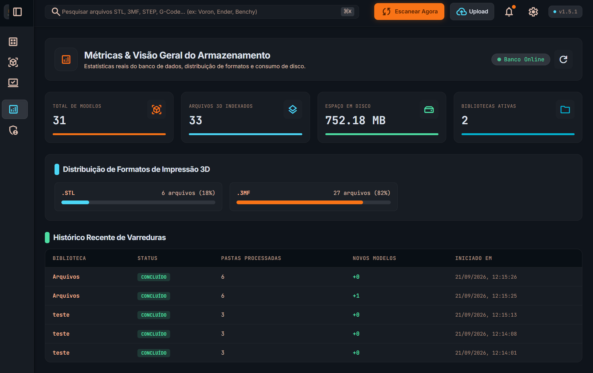

# Martins3DVault 🖨️✨ (v1.7.0)

<div align="center">

**Sistema Moderno, Dark/Light Mode & Conteinerizado para Organização, Visualização 3D Ultrarrápida e Gerenciamento de Projetos de Impressão 3D (.stl, .3mf, .obj)**
*Interface reconstruída e alinhada ao Google Stitch Design System ("Martins3D Vault Manager") com controles estilo Eagle App, alternância dinâmica de temas e precificação comercial analítica.*

[](#-execução-com-docker-compose)
[](https://github.com/cpginfo/martins3dvault/actions/workflows/publish.yml)
[](https://github.com/cpginfo/martins3dvault/pkgs/container/martins3dvault)
[](https://nextjs.org)
[](https://nodejs.org)
[](https://threejs.org)
[](https://prisma.io)
[](https://tailwindcss.com)
[](https://stitch.withgoogle.com)

</div>

---

## 📸 Demonstração Visual (Screenshots)

<div align="center">

| 🖩 Calculadora de Preço de Venda 3D | 📑 Gestão de Orçamentos & Vendas |
|:---:|:---:|
| <a href="screenshots/calculadora.png" target="_blank"></a> | <a href="screenshots/orcamentos.png" target="_blank"></a> |
| *Simulação analítica de energia, filamento, desgaste, mão de obra e markup dinâmico* | *Controle de pedidos, conversão em vendas reais, importação de planilhas e exportação CSV* |

| 📐 Visualizador 3D Studio & Fatiamento | 🦅 Galeria de Modelos & Controles Eagle |
|:---:|:---:|
| <a href="screenshots/arquivo.png" target="_blank"></a> | <a href="screenshots/colecao.png" target="_blank"></a> |
| *Viewport Three.js com HUD milimétrico, presets de câmera, materiais e drawer técnico* | *Grid ajustável estilo Eagle com zoom dinâmico, badges de polímero e toggle de impressão* |

| 📂 Catálogo de Coleções & Métricas Bento | 📊 Terminal de Oficina & Telemetria |
|:---:|:---:|
| <a href="screenshots/colecoes.png" target="_blank"></a> | <a href="screenshots/metricas.png" target="_blank"></a> |
| *Métricas Bento de armazenamento RAID 5 e pastas físicas espelhadas* | *Fila de bancada, telemetria industrial e monitoramento Klipper/Bambu* |

| 📁 Mapeamento de Pastas & Scan Inteligente | 👤 Gestão de Usuários & Permissões |
|:---:|:---:|
| <a href="screenshots/pastas.png" target="_blank"></a> | <a href="screenshots/usuarios.png" target="_blank"></a> |
| *Engine AdditiveCore com status de volumes e espelhamento bidirecional no disco* | *Tabela de operadores RBAC com avatares persistentes e 5 campos de cadastro* |

| 🌐 Upload de Arquivos & Download por Link |
|:---:|
| <a href="screenshots/upload.png" target="_blank"></a> |
| *Upload multipart de arquivos 3D e download de pacotes ZIP direto para o cofre* |

</div>

---

## 🌟 Principais Recursos

- 🚀 **Navegação & Carregamento 3D sob Demanda (`v1.7.0`)**:
  - **Menu Lateral Reestruturado**: Item **"Modelos 3D"** reposicionado no topo da seção *Repositórios Locais*, antes de **"Coleções"**, agilizando o acesso imediato ao catálogo completo de peças e projetos.
  - **Carregamento sob Demanda da Malha 3D**: Ao abrir qualquer arquivo (no modal de detalhes ou no estúdio 3D), o Three.js não baixa nem processa automaticamente as malhas pesadas (.stl, .3mf, .obj). Isso economiza largura de banda e elimina o consumo desnecessário de memória e GPU.
  - **Miniatura com Metadados**: Exibição da thumbnail nítida do projeto com badges dos formatos disponíveis e cálculo automático do peso total do projeto.
  - **Botão "Carregar Malha 3D"**: Inicialização do WebGL e renderização interativa sob demanda pelo usuário, com barra de progresso em tempo real.
  - **Alternância Flexível "Ver Miniatura"**: Botão na barra superior para descarregar o WebGL e retornar à miniatura 2D a qualquer momento.

- 🖩 **Calculadora de Preço de Venda 3D, Orçamentos & Vendas (`v1.6.0`)**:
  - **Motor Matemático Analítico Determinístico**: Cálculo rigoroso de custos combinando **Energia** (`(Watts/1000) × h × kWh`), **Desgaste/Depreciação** (`(Valor/VidaÚtil) × h`), **Material Consumido** (`(R$/kg ÷ 1000) × g`), **Mão de Obra** (`horas manuais × R$/h`) e **Acessórios Extras** (fitas LED, ímãs, parafusos, componentes eletrônicos).
  - **Live Breakdown em Tempo Real**: Feedback visual instantâneo recalculado a cada digitação com barras proporcionais de custo e cálculo de MarkUp (%) customizável.
  - **Gestão Comercial & Orçamentos**: Listagem com busca instantânea parcial por peça ou cliente, filtros rápidos por orçamentos abertos vs. vendas concretizadas e ação de **Duplicar / Reutilizar** orçamento antigo como base de novos pedidos.
  - **Conversão em Venda & Preço Real**: Opção de marcar orçamento como venda informando o preço real vendido praticado, calculando automaticamente lucros líquidos e descontos/acréscimos.
  - **Dashboard Financeiro Inteligente**: Métricas exclusivas sobre vendas concretizadas (Faturamento Real, Custos de Produção, Lucro Líquido, Margem Média %, Quantidade de Peças e Ticket Médio) com filtros de período (Mês Atual, Últimos 30 Dias ou Todo o Período).
  - **Importação Inteligente de Vendas (CSV ou Excel)**: Suporte a upload de arquivo `.csv` ou colar diretamente células do Excel (<kbd>Ctrl</kbd> + <kbd>V</kbd>) com detecção automática de delimitadores (`;`, `,`, `\t`) e conversão de moeda brasileira. Disponível também via CLI (`scripts/import-sales.ts`).
  - **Exportação de Vendas em CSV**: Botão nativo para exportar o histórico de vendas em `.csv` padronizado para o Microsoft Excel brasileiro (ponto e vírgula, decimais com vírgula e cabeçalho UTF-8 BOM).
  - **Catálogo de Materiais & Configurações da Máquina**: Gestão persistente de filamentos e resinas (R$/kg) e parâmetros elétricos e depreciativos da impressora.

- 💎 **Nova Identidade Visual & Branding Neon (`v1.6.0`)**:
  - **Logotipo Neon Isométrico**: Novo emblema isométrico com acabamento de alta fidelidade e canal alfa verdadeiro (32-bit RGBA), eliminando padrões de fundo falso e artefatos de compressão.
  - **Favicon Multi-Resolução**: Arquivo `favicon.ico` nativo em 16x16, 32x32, 48x48 e 64x64 px com suporte a telas HiDPI/Retina servido na raiz web e no App Router.
  - **Navegação Reestruturada**: Barra lateral reordenada com menus dedicados (*Calculadora*, *Métricas* e *Configurações*), cabeçalho da Navbar limpo e alinhamento centrado da marca.

- 🌓 **Temas Dark & Light Dinâmicos (`v1.5.5`)**:
  - **Botão de Alternância Integrado**: Atalho rápido no topo da Navbar e no menu do operador na Sidebar para trocar instantaneamente entre os modos **Dark** e **Light**, com persistência em `localStorage` e zero cintilação (*anti-FOUC*).
  - **Light Mode Calibrado & Conforto Visual**:
    - Fundo Global em Slate 100 (`#f1f5f9`) e superfícies de apoio em Slate 50 (`#f8fafc`), evitando fadiga visual do branco puro uniforme.
    - Cards de modelos e gavetas de inspeção em branco puro (`#ffffff`) com elevação suave e divisores em Slate 200 (`#e2e8f0`).
    - Tipografia de precisão com contraste WCAG AAA: títulos em Slate 900 (`#0f172a`), labels em Slate 600 (`#475569`) e metadados em Slate 500 (`#64748b`).
    - Identidade vibrante calibrada: Laranja de ação em Orange 600 (`#ea580c`) com contraste 4.5:1+, Azul técnico Sky 600 (`#0284c7`) e status Online em Emerald 600 (`#16a34a`).
  - **Mesa 3D Híbrida / Estúdio CAD**:
    - **Estúdio Claro**: Fundo em degradê sutil cinza-claro (`#f8fafc`), grid milimétrico em Slate 300 (`#cbd5e1`) com eixos de precisão.
    - **Dark Canvas Híbrido**: Alternância com 1 clique para renderização 3D escura/cinza-ardósia (`#0b0e17`) mantendo toda a interface em Light Mode.

- 🎨 **Design System Google Stitch ("Martins3D Vault Manager")**:
  - Tema escuro de alto contraste com paleta industrial (`#0f141b`), detalhes em laranja (`#f97316`), ciano (`#4cd7f6`) e esmeralda (`#4edea3`).
  - Tipografia de precisão com **Inter**, **JetBrains Mono** e **Material Symbols Outlined**.
  - **Sidebar Retrátil Persistente**: Acesso rápido a Modelos 3D, Coleções, Terminal de Oficina, Pastas & Scan e Usuários, com medidor de armazenamento do NAS em RAID 5 e perfil do operador.
  - **Barra Superior (Navbar)**: Busca global integrada com atalho `⌘K`, filtros rápidos de formato (`.STL`, `.3MF`, `G-Code`), status ao vivo do NAS e gatilho de escaneamento.

- 🦅 **Controles de Estúdio Estilo Eagle App**:
  - **Slider de Zoom de Thumbnails**: Ajuste contínuo do tamanho dos cards de 180px até 400px em tempo real.
  - **Modos de Visualização Comutáveis**: Alternância instantânea entre **Grade Grande** (*Large Grid*), **Grade Compacta** (*Compact Grid*) e **Modo Tabela** (*Table View*).
  - **Filtros Rápidos por Polímero**: Badges interativos de contagem para filamentos **PLA**, **PETG**, **ABS/ASA** e **TPU**.

- 📐 **Visualizador 3D Studio (`/models/[id]`)**:
  - **Interface Completa do Stitch**: Viewport Three.js em tela cheia com HUD de dimensões milimétricas em tempo real (`X`, `Y`, `Z`), pílula de controles de câmera (`Iso`, `Frente`, `Topo`, `Reset`), rotação automática, modo Wireframe/Sólido e bounding box.
  - **Barra Flutuante de Materiais**: Simulação de acabamento para **PLA**, **ABS**, **PETG** e **Fosco** com paleta de 12 cores de filamento e halo iluminado.
  - **Captura "Capa 3D"**: Snapshot em alta resolução do ângulo atual persistido diretamente como thumbnail oficial.
  - **Drawer Técnico Lateral**: Parâmetros recomendados de fatiamento (camada, tempo, filamento em gramas/metros, triângulos da malha), avaliação de compatibilidade de volume para mesas padrão (Bambu Lab 256mm e Voron 300mm), notas de bancada e gerenciamento de manuais PDF.

- ⚡ **Motor 3D de Alta Velocidade (Three.js + Streaming Binário)**:
  - **Zero travamento**: Converte e armazena em cache arquivos `.3mf` pesados em STL Binário consolidado, resolvendo lentidão em arquivos complexos de fatiadores modernos.
  - **Orientação Correta de Impressão**: Malhas posicionadas em pé na mesa (`rotation.x = -Math.PI / 2`, apoiadas em `Y = 0`).
  - **Predefinições de Câmera**: Alternância com 1 clique entre visões **Iso** (Isométrica), **Frente** (Frontal) e **Topo** (Superior).
  - **Materiais de Impressão**: Simulação de acabamento para **PLA**, **ABS**, **PETG Translúcido** e **Fosco (Matte)**.
  - **Paleta de 12 Cores de Filamento**: Preto, Branco, Cinza, Vermelho, Azul, Verde, Amarelo, Laranja, Roxo, Rosa, Dourado e Cobre.
  - **Dimensões em tempo real**: Bounding Box 3D com medidas em milímetros (X, Y, Z).
  - **Snapshot 3D com 1 clique**: Capture qualquer ângulo da câmera diretamente pelo navegador e salve como nova capa.

- 🖨️ **Controle de Impressão (Check de Impressos & Não Impressos)**:
  - **1-Clique no Card**: Alterne instantaneamente entre `[ ○ Não impresso ]` e `[ ✓ Impresso ]` diretamente na galeria principal.
  - **Filtro de "Nunca Impressos"**: Exiba com um toque apenas os projetos que ainda não foram para a mesa de impressão.
  - **Controle por Peça no Modal**: Marque peças individuais como impressas na aba "Arquivos" para projetos compostos.
  - **Histórico & Data**: Registro automático da data e horário de conclusão.

- 📊 **Terminal de Oficina & Fila de Bancada (`/metrics`)**:
  - Painel de telemetria industrial preparado para Moonraker / Klipper.
  - 4 Cards Bento de métricas: Impressões Hoje, Taxa de Sucesso, Consumo de Filamento (kg) e Tempo Ativo.
  - Fila de impressão em bancada com progresso em tempo real e status de bicos/mesa.

- 📁 **Mapear Pastas & Scan Inteligente com Espelhamento Total (`/libraries`)**:
  - Engine AdditiveCore com monitoramento de armazenamento RAID 5 e integridade SHA-256.
  - **Espelhamento Físico & Limpeza Automática (`v1.5.4`)**: Ao deletar pastas físicas do diretório `libraries`, o escaneamento remove automaticamente os modelos órfãos e deleta as coleções correspondentes do banco de dados e da barra lateral/interface.
  - Botão de varredura manual com terminal de logs e status em tempo real.

- 📂 **Gestão Física de Coleções & Movimentação em Lote (`/collections/[id]`)**:
  - **Pastas Físicas no Repositório**: Toda coleção criada ganha uma pasta física correspondente na biblioteca.
  - **Seleção Múltipla de Arquivos**: Checkboxes nos cartões com botão "Selecionar Todos" e barra flutuante de ações.
  - **Movimentação Física Completa**: Ao mover arquivos para outra coleção (existente ou nova), o sistema move fisicamente o arquivo 3D principal, imagens de capa/renders e manuais em PDF.
  - **Prevenção de Sobrescrita**: Resolução automática de conflito de nomes adicionando sufixo numérico incremental (ex: `Modelo (1).3mf`), preservando ambos os arquivos.

- ✏️ **Renomeação Física no Disco**:
  - Edição direta de título com persistência física: renomeia o arquivo 3D, a imagem de capa e o manual PDF diretamente na pasta do repositório.

- 🌐 **Upload via Link / Download por URL**:
  - Aba integrada no modal de upload para colar links HTTP/HTTPS de arquivos 3D (`.stl`, `.3mf`, `.obj`, `.step`) ou pacotes `.zip`.
  - Download via stream direto para a pasta física e vinculação automática com a coleção **`download`**.
  - Descompactação automática de pacotes ZIP com extração de metadados de impressão.

- 👤 **Gestão Completa de Usuários (`/users`)**:
  - **Edição e Criação com 5 Campos**: Controle total sobre **Nome**, **Foto de Perfil (Avatar)**, **Senha**, **E-mail** e **Perfil / Nível de Acesso** (`ADMIN`, `OPERATOR`, `VIEWER`).
  - **Upload e Persistência de Foto**: Envio de fotos locais (PNG, JPG, WebP) com preview imediato, processamento em Base64 e persistência em `/data/thumbnails/`.
  - **Segurança de Senhas & Unicidade**: Redefinição opcional de senha mantendo a existente caso deixada em branco e validação de e-mail exclusivo (409 Conflict).
  - **Integração Visual com Sessão**: O avatar do usuário é incorporado ao token JWT e exibido dinamicamente no menu lateral (`Sidebar`) e na tabela de usuários.

- 🗄️ **Provisionamento Automático no Primeiro Boot (`v1.5.1`)**:
  - **Criação do Usuário, Senha e Banco**: Ao iniciar com volume vazio, o PostgreSQL 16 cria automaticamente o usuário (`POSTGRES_USER`), senha (`POSTGRES_PASSWORD`) e database (`POSTGRES_DB`) definidos no `docker-compose.yml`.
  - **Sincronização Automática de Tabelas**: O container web aguarda o PostgreSQL estar saudável e executa `prisma db push` dinamicamente com base na `DATABASE_URL` do Compose, gerando todas as 9 tabelas, índices e relações no banco correto.
  - **Criação do Administrador Inicial**: O usuário administrador padrão (`ADMIN_EMAIL` / `ADMIN_PASSWORD`) e biblioteca inicial são cadastrados automaticamente.
  - **Fallbacks Seguros**: Variáveis possuem valores padrão `${VAR:-default}` para garantir execução mesmo sem arquivo `.env` pré-configurado.

- 🚀 **Publicação Automática & CI/CD (GitHub Actions - `v1.5.6`)**:
  - Pipeline automatizado em `.github/workflows/publish.yml`.
  - Autenticação configurada via Secret dedicado **`GHCR_TOKEN`** com escopos `write:packages` e `repo` para publicação no GitHub Container Registry e criação de releases.
  - Validação estrita de TypeScript e compilação Next.js antes de qualquer publicação.
  - Build e publicação automática no GitHub Container Registry (`ghcr.io/cpginfo/martins3dvault`).
  - Criação automática de GitHub Releases com notas de versão para tags `v*`.

- 🔒 **Login Seguro & Autenticação (`/login`)**:
  - Tela de login com fundo CAD isométrico, telemetria de hardware e botão de preenchimento rápido para demonstração.
  - Proteção integral de todas as rotas e endpoints de API exigindo perfil `ADMIN`.

---

## 🚀 Execução com Docker Compose

A forma recomendada de executar o Martins3DVault é via Docker Compose:

### 1. Iniciar os Containers
```bash
docker compose up -d --build
```

O compose iniciará:
1. `3d-vault-db`: Banco de dados PostgreSQL 16 com volume persistente e auto-provisionamento de credenciais.
2. `3d-vault-web`: Aplicação Next.js standalone na porta 3000 com sincronização de tabelas e monitoramento de saúde ativo.

### 2. Verificar Status de Saúde
```bash
docker compose ps
# 3d-vault-db:  Up (healthy)
# 3d-vault-web: Up (healthy)
```

### 3. Acessar a Aplicação
Abra o navegador em: **[http://localhost:3000](http://localhost:3000)**

**Credenciais Administrativas Padrão:**
- **E-mail:** `admin@printvault.local`
- **Senha:** `admin123`

---

## 🔧 Variáveis de Ambiente no `docker-compose.yml`

| Variável | Valor Padrão | Descrição |
| :--- | :--- | :--- |
| `PORT` | `3000` | Porta interna do servidor HTTP |
| `POSTGRES_USER` | `printvault` | Usuário do banco de dados PostgreSQL |
| `POSTGRES_PASSWORD` | `vaultpass123` | Senha do usuário do banco de dados |
| `POSTGRES_DB` | `printvault` | Nome da base de dados no PostgreSQL |
| `DATABASE_URL` | `postgresql://${POSTGRES_USER}:${POSTGRES_PASSWORD}@db:5432/${POSTGRES_DB}?schema=public` | String de conexão dinâmica com o PostgreSQL |
| `JWT_SECRET` | `change_me_...` | Chave de assinatura dos tokens JWT |
| `ADMIN_EMAIL` | `admin@printvault.local` | E-mail do administrador padrão |
| `ADMIN_PASSWORD` | `admin123` | Senha inicial do administrador |
| `STORAGE_DATA_PATH` | `/data` | Diretório de thumbnails, caches e uploads |
| `STORAGE_LIBRARIES_PATH` | `/libraries` | Ponto de montagem de pastas de arquivos 3D |
