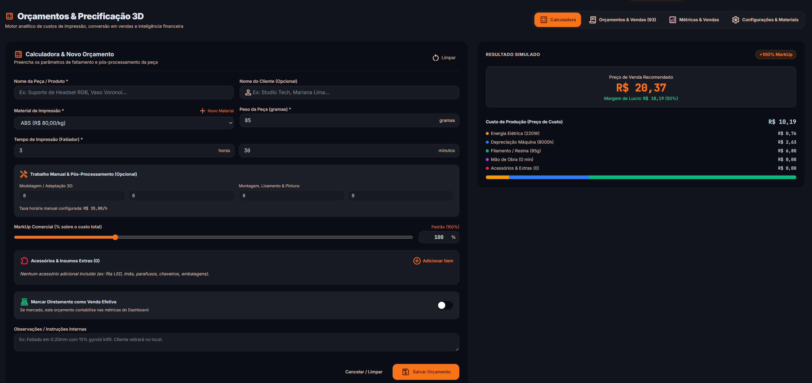
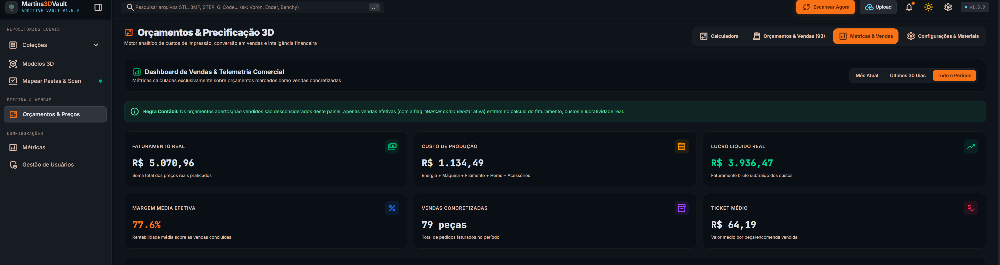
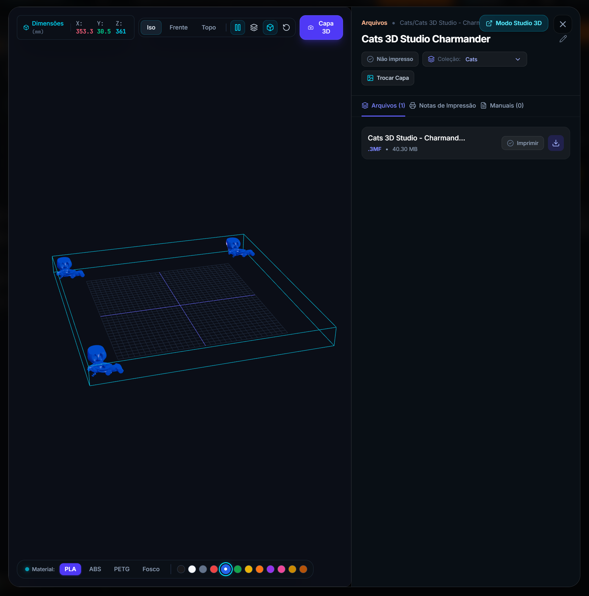
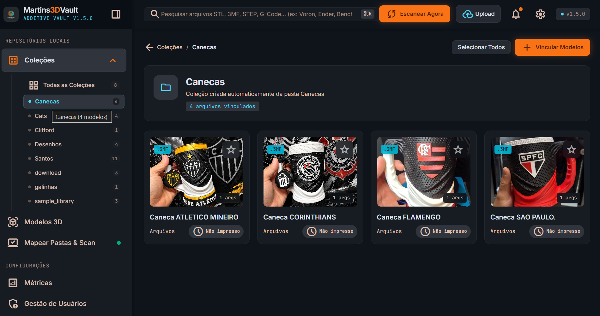
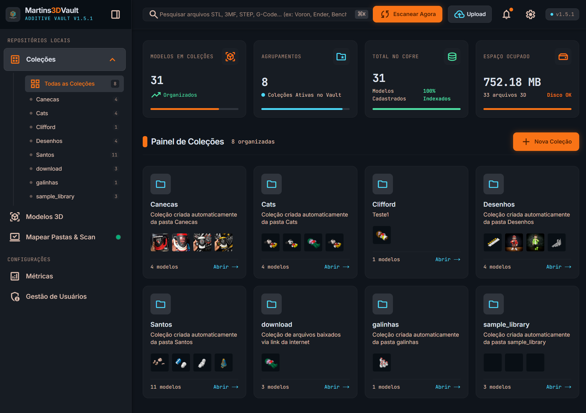
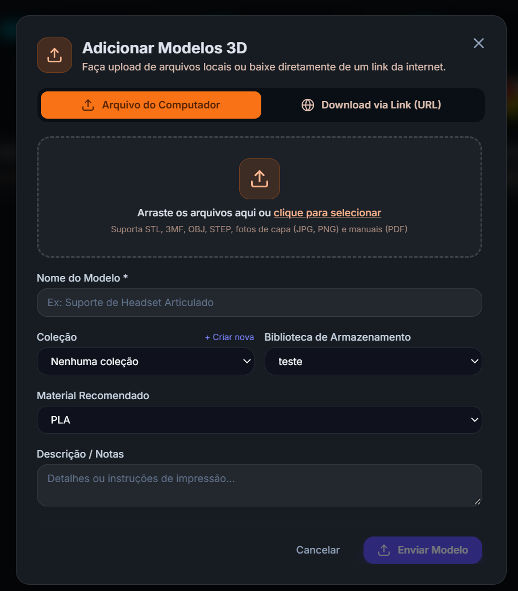
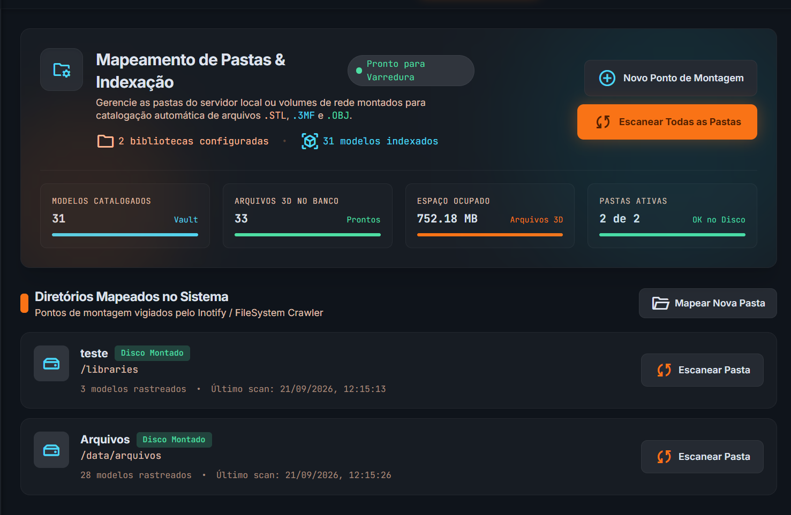
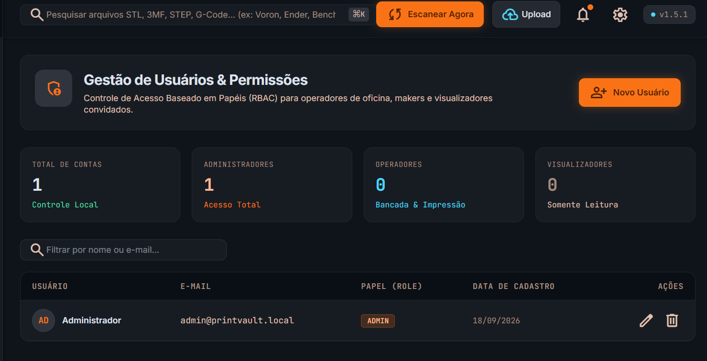

# Martins3DVault 🖨️✨ (v1.9.1)

<div align="center">

**Sistema Moderno, Dark/Light Mode & Conteinerizado para Organização, Visualização 3D Ultrarrápida e Gerenciamento de Projetos de Impressão 3D (.stl, .3mf, .obj)**
</div>

---

## 📸 Demonstração Visual (Screenshots)

<div align="center">

| 🖩 Calculadora de Preço de Venda 3D | 📑 Gestão de Orçamentos & Vendas |
|:---:|:---:|
| <a href="screenshots/calculadora.png" target="_blank"></a> | <a href="screenshots/orcamentos.png" target="_blank"></a> |
| *Simulação analítica de energia, filamento, desgaste, mão de obra e markup dinâmico* | *Controle de pedidos, conversão em vendas reais, importação de planilhas e exportação CSV* |

| 📐 Visualizador 3D Studio | 🦅 Galeria de Modelos |
|:---:|:---:|
| <a href="screenshots/arquivo.png" target="_blank"></a> | <a href="screenshots/colecao.png" target="_blank"></a> |
| *Viewport Three.js com HUD milimétrico, presets de câmera, materiais e drawer técnico* | *Grid ajustável estilo Eagle com zoom dinâmico, badges de polímero e toggle de impressão* |

| 📂 Catálogo de Coleções & Métricas  |  🌐 Upload de Arquivos & Download por Link  |
|:---:|:---:|
| <a href="screenshots/colecoes.png" target="_blank"></a> |  <a href="screenshots/upload.png" target="_blank"></a> |
| *Métricas Bento de armazenamento RAID 5 e pastas físicas espelhadas* |  *Upload multipart de arquivos 3D e download de pacotes ZIP* |

| 📁 Mapeamento de Pastas & Scan Inteligente | 👤 Gestão de Usuários & Permissões |
|:---:|:---:|
| <a href="screenshots/pastas.png" target="_blank"></a> | <a href="screenshots/usuarios.png" target="_blank"></a> |
| *Engine AdditiveCore com status de volumes e espelhamento bidirecional no disco* | *Tabela de operadores RBAC com avatares persistentes e 5 campos de cadastro* |

</div>

---

## 🌟 Principais Recursos

- 🗂️ **Gestão Local dos Arquivos de Impressão**:
  - Todo o acervo é gerenciado diretamente a partir dos arquivos físicos no disco, sem depender de upload manual ou duplicação de dados.

- 🌳 **Coleções Hierárquicas em Árvore (Pastas Aninhadas)**:
  - Espelhamento fiel da estrutura de subpastas do disco em formato de árvore (`parentId` recursivo).
  - Atribuição automática de arquivos apenas na pasta folha (*leaf folder*), eliminando duplicidades na raiz.
  - Navegação com Breadcrumbs dinâmicos, cards de subcoleções navegáveis e explorador em árvore expansível/retrátil na barra lateral (`Sidebar.tsx`) e na visualização de coleções.
  - Criação de novas subpastas e sincronização bidirecional em tempo real com o sistema de arquivos físico.

- 🧹 **Gerenciamento e Limpeza de Cache de Renderização 3D (`/metrics`)**:
  - Monitoramento do armazenamento ocupado por malhas pré-processadas (`/data/cache`) com exibição de volume em MB/GB e contagem de arquivos.
  - Ação de limpeza instantânea com modal de confirmação e relatório de bytes liberados.

- ⚙️ **Extração Real de Fatiamento (.3mf) & Avaliação de Mesa**:
  - Leitura profunda de arquivos `.3mf` (Bambu Studio, OrcaSlicer, PrusaSlicer) extraindo altura de camada, filamento, bico, infill e malha de triângulos/faces.
  - Avaliação imediata de **Compatibilidade de Volume de Mesa** com chips dinâmicos para Bambu Lab X1C (256mm), Voron 2.4 (300mm) e Creality K1 Max.
  - Estimativa precisa de consumo de filamento em gramas e metros no Studio 3D e no modal de detalhes rápidos.

- 🖼️ **Catálogo com Capas Automáticas**:
  - Arquivos `.3mf` que possuam uma imagem correspondente (mesmo nome, extensão `.jpeg` ou `.png`) exibem essa imagem automaticamente como capa no catálogo.
  - Se houver também um `.pdf` de mesmo nome, ele é vinculado automaticamente como manual de instruções do arquivo — sem nenhuma configuração adicional.

- 🔄 **Sincronização Bidirecional com o Disco**:
  - Mover arquivos entre coleções ou criar novas coleções pelo sistema reflete imediatamente na estrutura real de pastas do disco — mantendo repositório físico e catálogo sempre consistentes.

- ✏️ **Renomeação Física no Disco**:
  - Edição direta de título com persistência física: renomeia o arquivo 3D, a imagem de capa e o manual PDF diretamente na pasta do repositório.

- 📁 **Mapear Pastas & Scan Inteligente com Espelhamento Total (`/libraries`)**

- 🌐 **Upload via Link / Download por URL**:
  - Download via stream direto para a pasta física e vinculação automática com a coleção **`download`**.
  - Descompactação automática de pacotes ZIP com extração de metadados de impressão.

- 👤 **Gestão Completa de Usuários com Perfis de Acesso (`/users`)**:
  - Controle granular de permissões por perfil de usuário, restringindo o que cada um pode visualizar, editar ou administrar no sistema.

- 🔒 **Login Seguro & Autenticação (`/login`)**:
  - Proteção integral de todas as rotas e endpoints de API exigindo perfil `ADMIN`.

---

## 🚀 Como executar a aplicação

### Pré-requisitos

Antes de começar, você precisa ter o **Docker** instalado na sua máquina.

- **Windows**: instale o [Docker Desktop](https://www.docker.com/products/docker-desktop/)
- **Linux/Mac**: instale o [Docker Engine](https://docs.docker.com/engine/install/) e o [Docker Compose](https://docs.docker.com/compose/install/)

### Passo a passo

1. **Baixe o arquivo** `docker-compose-prod.yaml` deste repositório e salve em uma pasta no seu computador (ex: `C:\meu-app\` ou `~/meu-app/`).

2. **Abra o terminal** dentro dessa pasta:
   - **Windows**: abra a pasta no Explorador de Arquivos, clique com o botão direito em um espaço vazio e selecione **"Abrir no Terminal"** (ou **"Abrir janela do PowerShell aqui"**)
   - **Linux/Mac**: abra o terminal e navegue até a pasta com `cd caminho/da/pasta`

3. **Execute o comando**:
```bash
   docker compose -f docker-compose-prod.yaml up -d
```
   O parâmetro `-d` faz a aplicação rodar em segundo plano (você pode fechar o terminal depois).

4. **Pronto!** A aplicação estará disponível em `http://localhost:3000`.

---

### 🪟 Instruções específicas para Windows (Docker Desktop)

1. Instale o [Docker Desktop para Windows](https://www.docker.com/products/docker-desktop/) e siga o instalador padrão.

2. Após instalar, **abra o Docker Desktop** e aguarde o ícone da baleia 🐳 na barra de tarefas ficar estável (sem animação de carregamento) — isso indica que o Docker está pronto para uso.

   > ⚠️ Se aparecer um aviso pedindo para habilitar o **WSL 2** (Windows Subsystem for Linux), siga as instruções na tela — o Docker Desktop cuida da instalação automaticamente.

3. Coloque o arquivo `docker-compose-prod.yaml` em uma pasta de sua preferência.

4. Abra o **PowerShell** ou **Prompt de Comando** nessa pasta:
   - Navegue até a pasta pelo Explorador de Arquivos
   - Clique com o botão direito em um espaço vazio → **"Abrir no Terminal"**

5. Execute o comando:
```powershell
   docker compose -f docker-compose-prod.yaml up -d
```

6. Para verificar se está rodando, abra o Docker Desktop e veja o container ativo na aba **Containers**, ou rode no terminal:
```powershell
   docker compose -f docker-compose-prod.yaml ps
```

---

### 🛑 Como parar a aplicação

```bash
docker compose -f docker-compose-prod.yaml down
```

### 📋 Ver os logs (caso algo dê errado)

```bash
docker compose -f docker-compose-prod.yaml logs -f
```
### Acessar a Aplicação
Abra o navegador em: **[http://localhost:3000](http://localhost:3000)**

**Credenciais Administrativas Padrão:**
- **E-mail:** `admin@printvault.local`
- **Senha:** `admin123`

---

## 🔧 Variáveis de Ambiente no `docker-compose-prod.yml`

| Variável | Valor Padrão | Descrição |
| :--- | :--- | :--- |
| `PORT` | `3000` | Porta interna do servidor HTTP |
| `POSTGRES_USER` | `printvault` | Usuário do banco de dados PostgreSQL |
| `POSTGRES_PASSWORD` | `vaultpass123` | Senha do usuário do banco de dados |
| `POSTGRES_DB` | `printvault` | Nome da base de dados no PostgreSQL |
| `DATABASE_URL` | `postgresql://${POSTGRES_USER}:${POSTGRES_PASSWORD}@db:5432/${POSTGRES_DB}?schema=public` | String de conexão dinâmica com o PostgreSQL |
| `JWT_SECRET` | `change_me_...` | Chave de assinatura dos tokens JWT |
| `ADMIN_EMAIL` | `admin@printvault.local` | E-mail do administrador padrão |
| `ADMIN_PASSWORD` | `admin123` | Senha inicial do administrador |
| `ADMIN_FORCE_RESET` | `false` | Se `true`, força a redefinição de senha do admin para `ADMIN_PASSWORD` ao iniciar o container |
| `STORAGE_DATA_PATH` | `/data` | Diretório de thumbnails, caches e uploads |
| `STORAGE_LIBRARIES_PATH` | `/libraries` | Ponto de montagem de pastas de arquivos 3D |