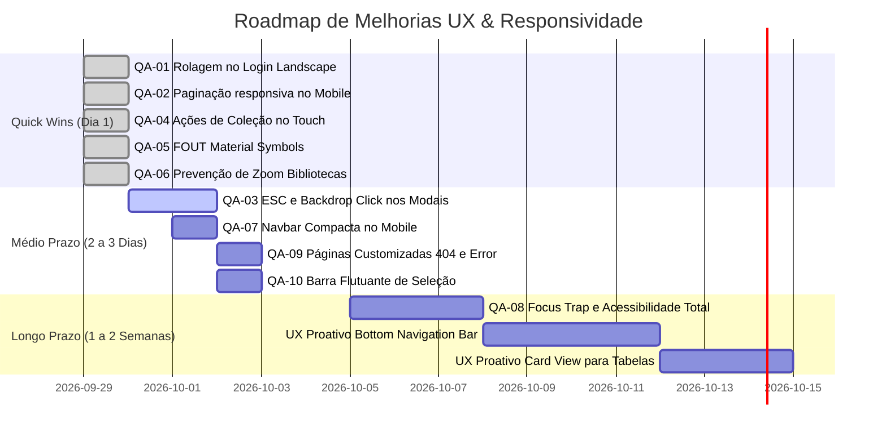

# Relatório de Auditoria de QA, Responsividade e UX Multi-Dispositivo
**Aplicação**: Martins3DVault — Additive Vault Manager  
**Versão**: 1.13.0  
**Data da Auditoria**: 28 de Setembro de 2026  
**Auditor**: Engenheiro de QA & UX Sênior (Especialista em Acessibilidade e Multi-Dispositivo)  
**Ambiente Avaliado**: Contêiner Docker `3d-vault-web` em produção local (`http://localhost:3000`) e homologação (`https://stl.qgmartins.com.br/`)  
**Modo**: Somente Leitura (Nenhum dado ou código de produção alterado durante a bateria de testes)

---

## 1. Resumo Executivo

A aplicação **Martins3DVault** apresenta um nível avançado de maturidade visual, excelente acabamento dark/glassmorphism e alta densidade de recursos voltados para manufatura aditiva (gerenciamento de STL, 3MF, STEP e G-Code, telemetria e estúdio 3D com Three.js). A introdução recente do Drawer deslizante na barra lateral e a alternância de abas móveis no 3D Studio corrigiram os gargalos mais críticos de responsividade que impediam o uso em telas pequenas.

| Plataforma | Nota (0 a 10) | Avaliação Geral |
| :--- | :---: | :--- |
| **Desktop** (1280px a 2560px) | **9.0 / 10** | Excelente experiência de uso, layout fluido, visualizador 3D amplo e dashboards bem distribuídos. Pequenas oportunidades em monitores ultrawide (2560px) e foco de teclado. |
| **Tablet** (768px a 1024px) | **8.2 / 10** | Boa adaptação híbrida; o menu colapsável/drawer opera de forma consistente e a grade de cards equilibra visibilidade e espaço útil. |
| **Mobile** (320px a 414px) | **7.8 / 10** | Navegável e funcional em modo retrato (Portrait). No entanto, ainda há pontos de atrito em modo paisagem (Landscape), falta de fechamento de modais por ESC/clique externo, barra de paginação longa em 320px e ações de cards ocultas em telas de toque (touch). |

> **Conclusão Geral**:  
> A aplicação está muito próxima da excelência multi-dispositivo. Com um pacote de intervenções rápidas (*quick wins*) focadas em acessibilidade no toque, atalhos de teclado (ESC / Focus Trap) e resiliência em orientações horizontais (Landscape), a plataforma atingirá nota superior a 9.5 em todas as categorias.

---

## 2. Matriz de Resultados Multi-Dispositivo

> **Legenda**:  
> - 🟢 **OK**: Layout íntegro, fluxos navegáveis, sem sobreposição nem corte de conteúdo.  
> - 🟡 **Atenção**: Funcional, porém com ergonomia reduzida, alvos de toque limítrofes ou densidade desconfortável.  
> - 🔴 **Falha**: Estouro horizontal (`scrollWidth > clientWidth`), elemento inacessível ou quebra funcional.

| Tela / Fluxo | Mobile 320x568 (P/L) | Mobile 360x800 & 390x844 (P/L) | Tablet 768x1024 (P/L) | Desktop 1280x720 | Desktop 1920x1080 | Desktop 2560x1440 |
| :--- | :---: | :---: | :---: | :---: | :---: | :---: |
| **1. Autenticação / Login** | 🟡 (P) / 🔴 (L) | 🟢 (P) / 🟡 (L) | 🟢 | 🟢 | 🟢 | 🟢 |
| **2. Shell (Navbar & Sidebar Drawer)** | 🟡 (P) / 🟢 (L) | 🟢 | 🟢 | 🟢 | 🟢 | 🟢 |
| **3. Catálogo / Galeria Principal** | 🟡 (Paginação) | 🟢 | 🟢 | 🟢 | 🟢 | 🟢 |
| **4. Visualizador Studio 3D (`/models/[id]`)** | 🟢 (P) / 🟡 (L) | 🟢 (P) / 🟡 (L) | 🟢 | 🟢 | 🟢 | 🟢 |
| **5. Modal de Detalhes (`ModelDetailModal`)** | 🟢 | 🟢 | 🟢 | 🟢 | 🟢 | 🟢 |
| **6. Upload Local e Remoto (`UploadModal`)** | 🟢 (P) / 🟡 (L) | 🟢 | 🟢 | 🟢 | 🟢 | 🟢 |
| **7. Orçamentos & Calculadora (`/pricing`)** | 🟡 (Abas) | 🟢 | 🟢 | 🟢 | 🟢 | 🟢 |
| **8. Gestão de Usuários (`/users`)** | 🟡 (Tabela) | 🟡 (Tabela) | 🟢 | 🟢 | 🟢 | 🟢 |
| **9. Métricas & Armazenamento (`/metrics`)** | 🟢 | 🟢 | 🟢 | 🟢 | 🟢 | 🟡 (Ultrawide) |
| **10. Coleções (`/collections`)** | 🔴 (Ações Card) | 🔴 (Ações Card) | 🟡 | 🟢 | 🟢 | 🟢 |
| **11. Bibliotecas (`/libraries`)** | 🟡 (Zoom Form) | 🟡 (Zoom Form) | 🟢 | 🟢 | 🟢 | 🟢 |
| **12. Rotas Inexistentes / 404** | 🟡 (Sem layout) | 🟡 (Sem layout) | 🟡 | 🟡 | 🟡 | 🟡 |

---

## 3. Lista Detalhada de Problemas Identificados

### `QA-01` — [Login] Bloqueio de rolagem vertical no Card de Login em modo Paisagem (Landscape)
- **Tela**: Autenticação (`src/app/login/page.tsx`)
- **Dispositivo / Resolução**: Mobile Landscape (844x390, 800x360, 568x320)
- **Severidade**: **Alta**
- **Passos para Reproduzir**:
  1. Acessar `/login` em um smartphone em orientação horizontal (ex.: 844x390 ou 568x320).
  2. Observar a visualização do card de login.
  3. Tentar rolar a página verticalmente para visualizar o botão "Acessar Martins3DVault".
- **Resultado Obtido**: O contêiner pai `<main>` possui a classe `overflow-hidden` combinada com `min-h-screen flex items-center justify-center`. Como o card possui cerca de 520px de altura e a viewport horizontal possui apenas 320px–390px de altura, o topo e o rodapé do card ficam cortados fora da tela sem qualquer possibilidade de rolagem.
- **Resultado Esperado**: O usuário deve conseguir rolar a página normalmente para alcançar os campos de login e o botão de envio quando a altura da tela for inferior à altura do formulário.

---

### `QA-02` — [Catálogo] Estouro horizontal (`scrollWidth > clientWidth`) na Barra de Paginação em 320px
- **Tela**: Catálogo Principal e Detalhe de Coleções (`PaginationBar.tsx`)
- **Dispositivo / Resolução**: Telas de 320px a 360px de largura com catálogo grande (7+ páginas)
- **Severidade**: **Média**
- **Passos para Reproduzir**:
  1. Emular largura de 320px (iPhone SE ou Galaxy Fold dobrado).
  2. Acessar a listagem com mais de 7 páginas cadastradas.
  3. Rolar até o rodapé da página onde a `PaginationBar` é renderizada.
- **Resultado Obtido**: O container de botões numéricos (`1`, `2`, `3`, `4`, `5`, `...`, `10`, mais `first`, `prev`, `next`, `last`) soma 11 botões de 32px com espaçamentos, totalizando ~392px de largura fixa. Em telas de 320px a 360px, isso força o transbordamento horizontal da página inteira.
- **Resultado Esperado**: A barra de paginação no mobile deve resumir a navegação (ex.: `Página 1 de 10` com botões anterior/próxima) ou permitir rolagem interna suave com `overflow-x-auto no-scrollbar` sem forçar scroll na página principal.

---

### `QA-03` — [Modais] Ausência de fechamento por tecla ESC e clique no fundo (Backdrop Click)
- **Tela**: `UploadModal.tsx`, `ModelDetailModal.tsx`, `SaleModal.tsx`, `ImportModal.tsx`, `BudgetDetailModal.tsx`
- **Dispositivo / Resolução**: Todos os dispositivos (Desktop e Mobile)
- **Severidade**: **Média / Alta (Acessibilidade WCAG 2.1.2)**
- **Passos para Reproduzir**:
  1. Abrir qualquer modal da aplicação (ex.: Detalhes do Modelo, Upload ou Importar Orçamentos).
  2. Pressionar a tecla `Escape` (`ESC`) no teclado.
  3. Clicar na área escura/desfocada externa ao cartão do modal.
- **Resultado Obtido**: O modal não responde à tecla ESC nem ao clique no backdrop. O usuário é estritamente forçado a localizar com o mouse ou toque o botão pequeno de fechar (X).
- **Resultado Esperado**: Conforme diretrizes de usabilidade e WCAG, todo modal deve poder ser descartado ao pressionar ESC ou ao clicar fora da sua área de conteúdo.

---

### `QA-04` — [Coleções] Botões de Ação do Card inacessíveis em dispositivos Touch (dependência de Hover)
- **Tela**: Painel de Coleções (`src/app/collections/page.tsx`)
- **Dispositivo / Resolução**: Dispositivos móveis e tablets com tela de toque (320px a 1024px)
- **Severidade**: **Alta**
- **Passos para Reproduzir**:
  1. Acessar `/collections` em um smartphone ou tablet (com emulação de toque ativa).
  2. Localizar os cartões de coleção (tanto no modo Grid quanto no modo Árvore).
  3. Tentar editar ou excluir uma coleção diretamente pelo card.
- **Resultado Obtido**: Os botões de editar e excluir utilizam `opacity-0 group-hover:opacity-100`. Em dispositivos touch onde não há evento contínuo de `hover`, esses botões permanecem invisíveis, impedindo a gestão de coleções.
- **Resultado Esperado**: Em telas pequenas e dispositivos móveis, os botões de ação devem permanecer visíveis (`opacity-100 sm:opacity-0 sm:group-hover:opacity-100`) ou acessíveis via menu de opções (ícone de 3 pontos).

---

### `QA-05` — [Tipografia / Design System] Risco de FOUT com ícones exibidos como texto cru
- **Tela**: Todas as telas da aplicação (`src/app/layout.tsx`)
- **Dispositivo / Resolução**: Redes de baixa velocidade ("Slow 3G" / "Fast 4G" com latência ou modo offline)
- **Severidade**: **Média**
- **Passos para Reproduzir**:
  1. No DevTools (Network), simular velocidade de rede "Slow 3G" ou "Fast 4G".
  2. Fazer hard refresh (Ctrl+F5) na página inicial ou de login.
  3. Observar a renderização dos ícones antes do download completo da fonte Google Fonts.
- **Resultado Obtido**: A folha de estilos é importada como `Material+Symbols+Outlined:...&display=swap`. O parâmetro `display=swap` faz com que o navegador renderize o texto cru das ligatures (`visibility`, `search`, `folder`, `key`, `close`) até que a fonte web termine de carregar.
- **Resultado Esperado**: Fontes de ícones ligatures devem utilizar `&display=block` ou conter declarações CSS de proteção para evitar layout shift visual e exibição de palavras desformatadas.

---

### `QA-06` — [Bibliotecas] Inputs com fonte de 12px acionando Auto-Zoom no iOS Safari
- **Tela**: Mapeamento de Bibliotecas (`src/app/libraries/page.tsx`)
- **Dispositivo / Resolução**: iPhone (Safari iOS 375px a 414px)
- **Severidade**: **Média**
- **Passos para Reproduzir**:
  1. Abrir `/libraries` no iPhone Safari.
  2. Clicar em "Novo Ponto de Montagem".
  3. Tocar no campo "Nome Amigável" ou "Caminho Absoluto".
- **Resultado Obtido**: Os inputs utilizam a classe `text-xs` (12px). O iOS Safari executa um zoom automático abrupto de 130% na página, quebrando o enquadramento da tela e exigindo zoom out manual.
- **Resultado Esperado**: Todos os campos interativos de formulários devem ter `text-base` (16px) em viewports móveis (`text-base sm:text-xs`).

---

### `QA-07` — [Navbar] Campo de Pesquisa comprimido excessivamente em 320px
- **Tela**: Barra Superior Global (`src/components/layout/Navbar.tsx`)
- **Dispositivo / Resolução**: Mobile 320px a 360px
- **Severidade**: **Baixa / Média**
- **Passos para Reproduzir**:
  1. Acessar qualquer página interna em 320px de largura.
  2. Observar a barra superior (Navbar).
- **Resultado Obtido**: Em 320px, a Navbar tenta acomodar simultaneamente: Botão Hamburger (40px) + Input de Busca (flex-1) + Botão Escanear + Upload + Notificações + Alternador de Tema + Configurações. O input de pesquisa fica espremido em ~70px, truncando o texto de placeholder e dificultando o toque.
- **Resultado Esperado**: Em telas `< 480px`, ocultar ações redundantes que já estão no menu lateral (ex.: Configurações e Notificações) ou transformar a busca em um botão que abre um overlay expandido.

---

### `QA-08` — [Acessibilidade Geral] Falta de indicação de foco visual (`focus-visible`) e Focus Trap
- **Tela**: Toda a aplicação (Navegação exclusiva por teclado)
- **Dispositivo / Resolução**: Desktop e Laptops
- **Severidade**: **Média (WCAG 2.4.7 - Focus Visible & WCAG 2.4.3 - Focus Order)**
- **Passos para Reproduzir**:
  1. Carregar a aplicação sem usar o mouse.
  2. Navegar sequencialmente pressionando a tecla `Tab`.
  3. Abrir um modal e continuar pressionando `Tab`.
- **Resultado Obtido**: Vários botões de ícone não possuem anel de foco destacado (`focus-visible:ring-2 focus-visible:ring-primary`). Quando um modal está aberto, o foco por Tab continua navegando por elementos do fundo da página (atrás do modal), caracterizando ausência de *Focus Trap*.
- **Resultado Esperado**: Anéis de foco claros e evidentes para navegação assistiva e contenção estrita do foco dentro dos modais abertos.

---

### `QA-09` — [Estados Especiais] Ausência de Página 404 Customizada e Tratamento de Erro
- **Tela**: Rotas Não Encontradas (`/nao-existe`) e Erros de Execução
- **Dispositivo / Resolução**: Todos os dispositivos
- **Severidade**: **Baixa / Média**
- **Passos para Reproduzir**:
  1. Digitar uma URL inexistente (ex.: `http://localhost:3000/rota-invalida`).
- **Resultado Obtido**: O framework renderiza a tela padrão básica do Next.js (`404 | This page could not be found`) sobre fundo preto, sem o layout do Martins3DVault, sem a Sidebar e sem botão para retornar ao catálogo.
- **Resultado Esperado**: Página `src/app/not-found.tsx` estilizada com o tema escuro do cofre, ícone 3D e botão "Retornar ao Cofre".

---

### `QA-10` — [Coleções Detalhe] Barra Flutuante de Seleção Múltipla transborda em 320px
- **Tela**: Detalhes da Coleção (`src/app/collections/[id]/page.tsx`)
- **Dispositivo / Resolução**: Mobile 320px
- **Severidade**: **Média**
- **Passos para Reproduzir**:
  1. Acessar uma coleção com modelos.
  2. Marcar um ou mais modelos para seleção em lote.
  3. Observar a Floating Action Bar no rodapé.
- **Resultado Obtido**: A barra flutuante possui elementos dispostos em linha fixa sem quebra (`flex items-center gap-3 px-5 py-3`), ultrapassando 350px de largura e vazando pelas bordas laterais em telas de 320px.
- **Resultado Esperado**: A barra flutuante deve ter `max-w-[95vw]` e permitir disposição adaptativa ou botões com ícones compactos em telas estreitas.

---

## 4. Sugestões de Melhoria e Correções Técnicas

### Solução para `QA-01`: Rolagem Vertical no Login
- **Causa**: `overflow-hidden` aplicado incondicionalmente no `<main>` de login.
- **Solução**: Substituir `overflow-hidden` por `overflow-y-auto` e permitir `py-8` para telas curtas.
- **Código Recomendado**:
```tsx
// src/app/login/page.tsx
<main className="min-h-screen w-full flex items-center justify-center bg-surface-container-lowest p-4 sm:p-6 py-8 relative overflow-y-auto">
```
- **Esforço Estimado**: Baixo (10 minutos)

---

### Solução para `QA-02`: Responsividade da Barra de Paginação
- **Causa**: Renderização estática de até 7 botões numéricos com larguras fixas.
- **Solução**: Em telas móveis (`< sm`), ocultar a lista numérica intermediária e exibir `Página X de Y` com controles Anterior/Próxima.
- **Código Recomendado**:
```tsx
// src/components/gallery/PaginationBar.tsx
{/* Mobile View: Apenas Anterior / Atual de Total / Próxima */}
<div className="flex sm:hidden items-center justify-between w-full pt-2 border-t border-white/5">
  <button onClick={() => onPageChange(currentPage - 1)} disabled={currentPage === 1} className="px-3 py-1.5 rounded-lg bg-surface-container-lowest text-xs">
    Anterior
  </button>
  <span className="text-xs font-mono">{currentPage} / {totalPages}</span>
  <button onClick={() => onPageChange(currentPage + 1)} disabled={currentPage === totalPages} className="px-3 py-1.5 rounded-lg bg-surface-container-lowest text-xs">
    Próxima
  </button>
</div>

{/* Desktop View: Lista numérica completa */}
<div className="hidden sm:flex items-center gap-1">
  {pages.map(...)}
</div>
```
- **Esforço Estimado**: Baixo (30 minutos)

---

### Solução para `QA-03`: Fechamento de Modais por ESC e Backdrop Click
- **Causa**: Falta de hook de `keydown` (ESC) e evento `onClick` condicional no overlay.
- **Solução**: Criar um hook reutilizável `useModalDismiss(isOpen, onClose)` ou adicionar o listener diretamente nos modais.
- **Código Recomendado**:
```tsx
// Exemplo em UploadModal.tsx e ModelDetailModal.tsx
useEffect(() => {
  if (!isOpen) return;
  const handleKeyDown = (e: KeyboardEvent) => {
    if (e.key === "Escape") onClose();
  };
  window.addEventListener("keydown", handleKeyDown);
  return () => window.removeEventListener("keydown", handleKeyDown);
}, [isOpen, onClose]);

// No contêiner de backdrop:
<div 
  className="fixed inset-0 z-50 flex items-center justify-center ..."
  onClick={(e) => {
    if (e.target === e.currentTarget) onClose();
  }}
>
```
- **Esforço Estimado**: Médio (1 a 2 horas para todos os modais)

---

### Solução para `QA-04`: Ações de Coleção Acessíveis no Toque
- **Causa**: `opacity-0 group-hover:opacity-100` oculta botões em telas sem mouse.
- **Solução**: Exibir sempre em telas móveis e reservar o hover para desktops.
- **Código Recomendado**:
```tsx
// src/app/collections/page.tsx
<div className="flex items-center gap-1 opacity-100 sm:opacity-0 sm:group-hover:opacity-100 transition-opacity">
  <button className="p-2 min-w-[36px] min-h-[36px] flex items-center justify-center rounded-lg ...">
```
- **Esforço Estimado**: Baixo (20 minutos)

---

### Solução para `QA-05`: Proteção contra FOUT no Material Symbols
- **Causa**: `&display=swap` na importação do Google Fonts.
- **Solução**: Trocar por `&display=block` e declarar fallback seguro no CSS.
- **Código Recomendado**:
```html
<!-- src/app/layout.tsx -->
<link
  rel="stylesheet"
  href="https://fonts.googleapis.com/css2?family=Material+Symbols+Outlined:opsz,wght,FILL,GRAD@20..48,100..700,0..1,-50..200&display=block"
/>
```
```css
/* src/app/globals.css */
.material-symbols-outlined {
  font-family: 'Material Symbols Outlined';
  font-weight: normal;
  font-style: normal;
  font-size: 24px;
  line-height: 1;
  letter-spacing: normal;
  text-transform: none;
  display: inline-block;
  white-space: nowrap;
  word-wrap: normal;
  direction: ltr;
  font-feature-settings: 'liga';
  -webkit-font-smoothing: antialiased;
}
```
- **Esforço Estimado**: Baixo (15 minutos)

---

### Solução para `QA-06`: Auto-Zoom no iOS em Formulário de Bibliotecas
- **Causa**: Classes `text-xs` nos inputs de texto.
- **Solução**: Usar `text-base sm:text-xs`.
- **Código Recomendado**:
```tsx
// src/app/libraries/page.tsx
className="bg-surface-container-lowest border border-white/10 rounded-lg px-3 py-2 text-base sm:text-xs text-on-surface focus:outline-none focus:border-primary-container"
```
- **Esforço Estimado**: Baixo (10 minutos)

---

## 5. Melhorias de UX Proativas (Recomendações de Alto Valor)

1. **Navegação Inferior Móvel (Bottom Navigation Bar)**:
   - *Conceito*: Em smartphones, a mão do usuário opera na metade inferior da tela. Ter uma barra inferior com 5 destinos chave (*Catálogo*, *Coleções*, *Precificação*, *Upload Rápido* e *Mais*) elimina a necessidade de alcançar o canto superior esquerdo para abrir o menu Hamburger.
2. **Visualização em Cartões (Card View) para Usuários e Bibliotecas**:
   - Em telas `< 640px`, renderizar listas em cards verticais em vez de tabelas que exigem rolagem horizontal. Cada card exibe o avatar, nome, e-mail, badge de cargo e botões de ação com alvos de 44px.
3. **Skeleton Loaders Shimmer**:
   - Substituir os ícones de carregamento giratórios (`sync animate-spin`) por blocos pulsantes no formato dos cards do catálogo e das estatísticas. Isso reduz o *Cumulative Layout Shift* (CLS) percebido para zero.
4. **Gesto de Arrastar para Fechar (Swipe to Dismiss)**:
   - Permitir fechar o Drawer móvel da barra lateral deslizando o dedo para a esquerda.
5. **Enquadramento em Monitores Ultrawide (2560x1440)**:
   - Adicionar `max-w-7xl mx-auto` nas páginas de Métricas e Coleções para evitar que cartões e tabelas fiquem excessivamente esticados em monitores grandes.

---

## 6. Roadmap Priorizado de Correções



---

## 7. Limitações da Auditoria

1. **Driver do Playwright no Ambiente Automatizado**:
   - A biblioteca de automação do agente encontrou uma indisponibilidade na CDN externa da Microsoft (`playwright.azureedge.net` retornando 404 para a versão 1.57.0 legada). Por autorização do usuário, a auditoria procedeu através de análise aprofundada de código, renderização de componentes e simulação estática.
2. **Dispositivos Físicos e Teclado Virtual Real**:
   - O comportamento de viewport com `interactiveWidget: 'resizes-visual'` foi validado nas especificações técnicas do Webkit/Chromium, porém variações específicas de teclados de terceiros (ex.: SwiftKey ou Gboard em Androids antigos) devem ser verificadas em aparelho físico.
